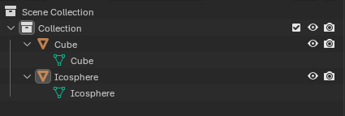

# Blender to Godot (BTG) Pipeline
A simple JSON-based Blender to Godot pipeline that supports Godot class and variable assignments from within Blender.

## Installing
* Download `blender_to_godot_pipeline.py` and install it as an add-on.
* Download the `TODO` Godot addon and import it into your favorite Godot project.

## Overview
NOTE: This pipeline is not fully automated. You need to write the entity definition yourself, hit the export button in Blender, and hit the import button in Godot. Exporting and importing the entity information is a separate process from exporting and importing your Blender models.

The pipeline uses two JSON files (You can name these files whatever you want.):
* `entity_definition.json`: A file written by you that exposes Godot classes and variables to Blender. You can expose both built-in and user-defined classes.
* `btg_import.json`: A file generated by the Blender add-on and used in the importer to assign your Godot classes and variables to your exported `.glb/.gltf` model.

The workflow is usually:
* Write `entity_definition.json` for your Godot project, updating it as you develop new functionality and want to expose new classes/variables.
  * Updates will need to be re-imported into Blender.
* Once you're finished in Blender, export your model and hit the `Write BTG import JSON` button.
  * NOTE: Exporting your model does not write the BTG JSON, exporting and importing the entity information is a separate process.
* In Godot, run the importer script on your `.glb/.gltf` model with the generated `btg_import.json` file to update the Nodes and their variables.

## Writing the Entity definition JSON
The pipeline uses a simple entity definition system. Each entity has a class name and a set of parameters. Each parameter has a: type, default, and description.

### `entity_defintion.json` Template:
```
{
  "ClassNameHere": {
    "var_name_here": ["type", default, "description"],
    "second_var_name_here": ...
  },
  "SecondClassName": {
    ...
  },
  ...
}
```

### Example `entity_definition.json`:
```
{
  "CharacterBody3D": {
    "floor_stop_on_slope": ["bool", true, "If true, the body will not slide on slopes when standing still."],
    "max_slides": ["int", 6, "Maximum number of times the body can change direction before it stops when calling move_and_slide."],
    "up_direction": ["Vector3", [0, 1, 0], "Vector pointing upwards, used to determine what is a wall and what is a floor."]
  },
  "Area3D": {
    "angular_damp": ["float", 0.1, "The rate at which objects stop spinning in this area."]
  }
}
```
### Things to Note
* Every parameter in the JSON other than `default` is a string.
* `default` represents your Godot variable type. Supported Godot types are:
  * String, ex: `"var_name": ["String", "", "desc"]`
  * int, ex: `"var_name": ["int", 0, "desc"]`
  * bool, ex: `"var_name": ["bool", false, "desc"]`
  * float, ex: `"var_name": ["float", 0.0, "desc"]`
  * Vector3, ex: `"var_name": ["Vector3", [0.0, 0.0, 0.0], "desc"]`
  * Vector3i, ex: `"var_name": ["Vector3i", [0, 0, 0], "desc"]`
* The above values are handled automatically by the importer. To Add new variable types, you'll have to define them in the importer yourself.
  * The Blender extension has a catch-all for unknown entries in the `type` field. If you enter a value that is not one of the above, it will be interpreted as a string.
  * The type will be exported along with the assigned string value. This type can then be added to the importer script and its value handled accordingly.

## BTG Import JSON
Once you have written your `entity_definition.json` file, imported it into your Blender project, and assigned your classes, you are ready to write the import JSON.

A Generated `btg_import.json` may look something like:
```
{
    "Cube": {
        "class": "CharacterBody3D",
        "variables": {
            "floor_stop_on_slope": ["bool", false],
            "max_slides": ["int", 19],
            "up_direction": ["Vector3", "(-0.32999998331069946, 1.149999976158142, 0.32999998331069946)"]
        }
    },
    "Icosphere": {
        "class": "Area3D",
        "variables": {
            "angular_damp": ["float", 0.8199999928474426]
        }
    }
}
```
### Things to Note:
* The `type` field of the variable is ported directly from the entity definition file to the BTG import file. This is to enable the user to implement types that aren't already supported or are user-defined.
* Given the scene hierarchy of the above:

  * The name of the Blender object is also the name of the corresponding Node in the imported `.glb` file.
  * The importer searches the scene and changes the type of the given node to `class` and assigns its variables based on `variables`. Pretty straight forward.


# TODO
* Revise instructions
* Add examples of running Godot importer
* Add examples of defining custom variables such as enums and class inputs